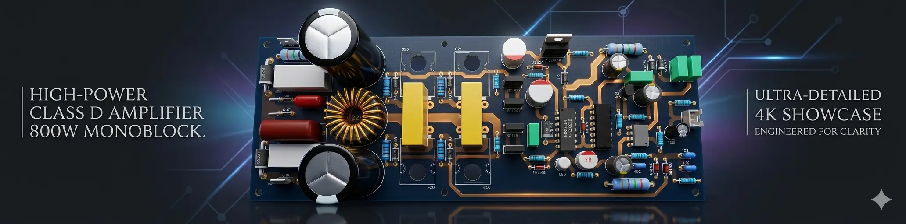
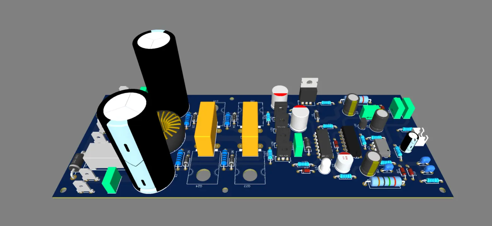
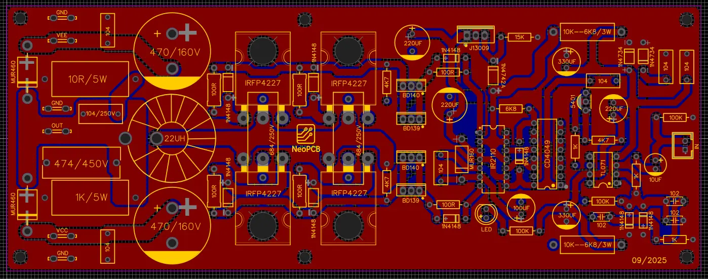
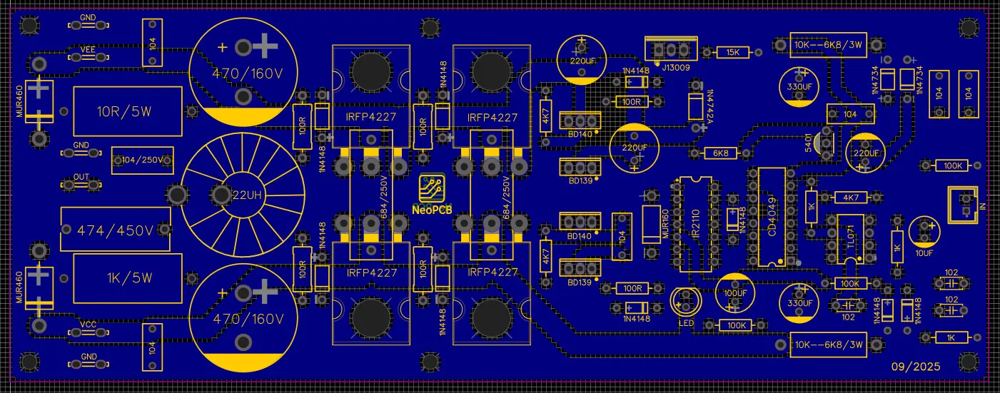
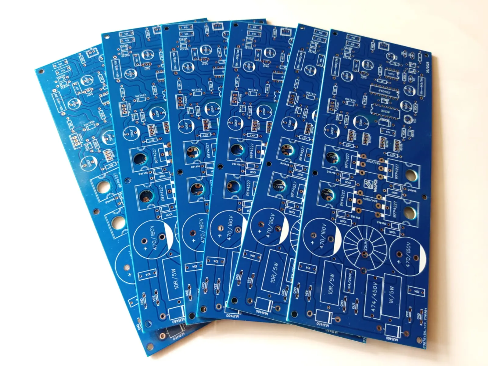

# 🔊 800W Class D Professional Amplifier PCB Design

  

High-power Class D amplifier PCB designed through reverse engineering and optimized for efficient audio performance.

---

# 📌 Project Overview

This project presents the design and development of a **high-power 800W Class D audio amplifier PCB**, created through a **reverse engineering process**.

The objective was to analyze an existing amplifier design and recreate an optimized, reliable PCB layout suitable for professional audio applications. The final design was implemented as a **double-layer FR4 PCB** and successfully tested under high-power conditions.

---

# ⚡ Problem

Designing high-power audio amplifiers requires careful consideration of **thermal performance, high-current routing, noise reduction, and component placement**. Reverse engineering such systems is challenging due to the lack of original schematics and design documentation.

---

# ✅ Solution

The amplifier circuit was carefully analyzed and redesigned using professional PCB design tools. Special attention was given to **power trace optimization, grounding techniques, and component layout** to ensure stable and efficient operation.

The final PCB was fabricated and tested successfully, demonstrating **low heat generation, stable performance, and high output power capability**.

---

# 🧠 System Architecture

The amplifier is based on a **Class D switching topology**, which provides high efficiency and low heat dissipation.

The system operates on a **dual power supply of ±90V DC** and uses **IRFP4227 MOSFETs** for high-current switching. The PCB layout was designed to handle high power levels with optimized trace widths, proper grounding, and minimized electrical noise.

The design includes power stages, driver sections, and output filtering components to ensure clean and stable audio output.

---

# 🔩 Hardware Specifications

- Output Power: **800W**  
- Amplifier Type: **Class D**  
- Power Supply: **±90V DC Dual Supply**  
- Power MOSFETs: **4 × IRFP4227**  
- PCB Type: **FR4 Double Layer**  
- Thermal Performance: **Low Heat Generation**  
- Application: **Professional Audio Systems**  

---

# 🧾 PCB Design

The PCB was designed using:

- **EasyEDA**  
- **Altium Designer**  

Key design considerations:

- High-current trace optimization  
- Proper grounding and noise reduction  
- Compact and efficient component placement  
- Top and bottom layer routing  

The board was manufactured through **JLCPCB**, ensuring high-quality fabrication and reliability.

---

# 🖼️ PCB & Hardware Preview

## 🔹 Complete PCB Prototype

  

## 🔹 Top Layer Design

  

## 🔹 Bottom Layer Design

  

## 🔹 Fabricated PCB

  

---

# 🎯 Key Features

- High-power 800W output capability  
- Efficient Class D operation  
- Low heat generation  
- Optimized PCB for high current  
- Stable and reliable performance  
- Reverse-engineered and redesigned layout  

---

# 🛠️ Technologies Used

### PCB Design
- Altium Designer  
- EasyEDA  

### Hardware
- IRFP4227 MOSFETs  
- FR4 Double Layer PCB  

### Manufacturing
- JLCPCB  

---

# 🎯 Applications

- Professional Audio Amplifiers  
- PA Systems  
- DJ Audio Systems  
- High-Power Sound Systems  

---

# 👨‍💻 Author

**Tharusha Sangeeth**  
Electronics & Embedded Systems Developer  

---

# 📜 License

This project is released for **educational and research purposes**.

---

# ⭐ Support

If you like this project, consider giving it a ⭐ on GitHub!
